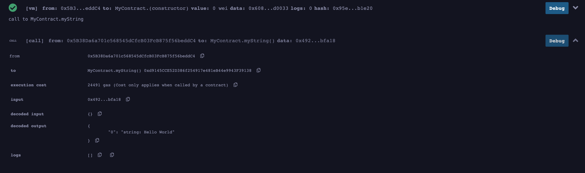
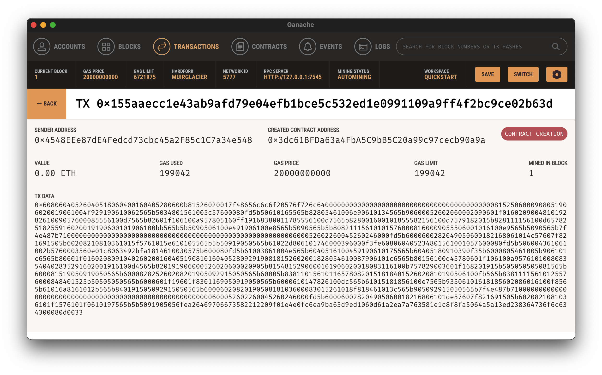

# Ethereum Blockchain Developer Bootcamp With Solidity (2022)

## Notes

1. [Remix IDE](./notes/remix.md)
2. [Blockchain basics](./notes/blockchain-basics.md)
3. [Ethereum primitives and objects](./notes/primitives-objects.md)
4. [Functions](./notes/functions.md)
5. [Constructor](./notes/constructor.md)

## Resources

-   [Documentation](https://ethereum-blockchain-developer.com/)
-   [Resources](https://docs.google.com/spreadsheets/d/1OO06RZ7vw8-Hij8ZxB68FaRYRtQEz3GifnLDNwW8sTs/edit#gid=1051902784)

## Practice

Practice exercises developed during the course.

  
Blockchain Networks

### [FirstSmartContract.sol](./contracts/FirstSmartContract.sol)

-   JavaScript VM(London) deploy 0xd9145CCE52D386f254917e481eB44e9943F39138

-   Ropsten deploy [0x8346f00379d30Dc3bf7D069C96a65ec6B30ac0EF](https://ropsten.etherscan.io/address/0x8346f00379d30Dc3bf7D069C96a65ec6B30ac0EF)

-   Web3 Provider deploy 0x3dc61BFDa63a4FbA5C9bB5C20a99c97cecb90a9a

  
Simple Variables

#### [Variables.sol](./contracts/Variables.sol)

#### [RollOver7.sol](./contracts/RollOver7.sol) pragma solidity 0.7.0;

#### [RollOver8.sol](./contracts/RollOver8.sol) pragma solidity ^0.8.1;

  
Deposit, withdraw

#### [SendMoneyExample.sol](./contracts/SendMoneyExample.sol)

  
Start, stop and destroy

#### [StartStopUpdateExample.sol](./contracts/StartStopUpdateExample.sol)

  
Mappings and Struct

#### [SimpleMappingExample.sol](./contracts/SimpleMappingExample.sol)

#### [MappingStructExample.sol](./contracts/MappingStructExample.sol)

