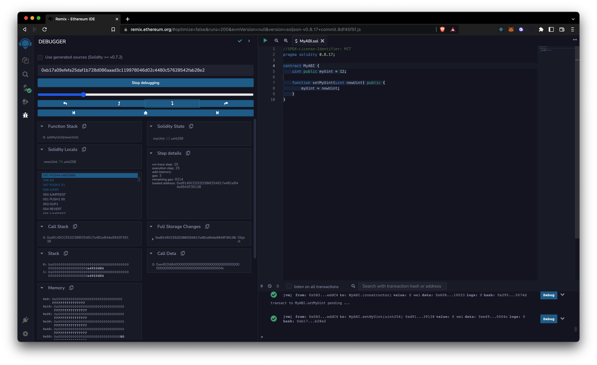

# ABI Array

-   The ABI (Application Binary Interface) array has the assembly opcodes telling the EVM during execution of a smart contract where to jump to (the first 4 bytes of the keccak hash of the function signature)

    -   Here's an example:

        ```Solidity
        //SPDX-License-Identifier: MIT
        pragma solidity 0.8.17;

        contract MyABI {
            uint public myUint = 12;

            function setMyUint(uint newUint) public {
                myUint = newUint;
            }
        }
        ```

        -   If we deploy our contract and call one of its functions we'll find thes jump destinations

            -   The following image shows the moment when 4 bytes are being pushed, the output looks like this `041 PUSH4 e492fd84`

                

            -   This output is the same as the first 4 bytes of the function signature `bytes4(keccak256(setMyUint(uint256)))`
            -   These interactions can be achieved with web3.js with something like this `contractInstance.methods.setMyUint(123)` and that's exactly where the ABI array is helpful because contains all functions, inputs and outputs, as well as all variables and their types from a smart contract
            -   The ABI Array for the previous contract will look like this:

                ```JSON
                [
                    {
                        "inputs": [],
                        "name": "myUint",
                        "outputs": [
                            {
                                "internalType": "uint256",
                                "name": "",
                                "type": "uint256"
                            }
                        ],
                        "stateMutability": "view",
                        "type": "function"
                    },
                    {
                        "inputs": [
                            {
                                "internalType": "uint256",
                                "name": "newUint",
                                "type": "uint256"
                            }
                        ],
                        "name": "setMyUint",
                        "outputs": [],
                        "stateMutability": "nonpayable",
                        "type": "function"
                    }
                ]
                ```

            -   And it's located inside the JSON file with the contract name inside the artifacts directory

    -   ABI interaction with Web3.js

        ```JavaScript
        (async() => {
            // Your contract address
            const address = "0xD7ACd2a9FD159E69Bb102A1ca21C9a3e3A5F771B";
            // Your contract ABI Array
            const abi = [
                {
                    "inputs": [],
                    "name": "myUint",
                    "outputs": [
                        {
                            "internalType": "uint256",
                            "name": "",
                            "type": "uint256"
                        }
                    ],
                    "stateMutability": "view",
                    "type": "function"
                },
                {
                    "inputs": [
                        {
                            "internalType": "uint256",
                            "name": "newUint",
                            "type": "uint256"
                        }
                    ],
                    "name": "setMyUint",
                    "outputs": [],
                    "stateMutability": "nonpayable",
                    "type": "function"
                }
            ];

            let contractInstance = new web3.eth.Contract(abi, address);
            console.log(await contractInstance.methods.myUint().call());
            // 12
            let accounts = await web3.eth.getAccounts();
            await contractInstance.methods.setMyUint(345).send({from: accounts[0]});
            console.log(await contractInstance.methods.myUint().call());
            // 345 after transaction

        })()
        ```

[Reference ABI Array](https://ethereum-blockchain-developer.com/2022-05-erc20-token/02-web3js-abi-array/)
