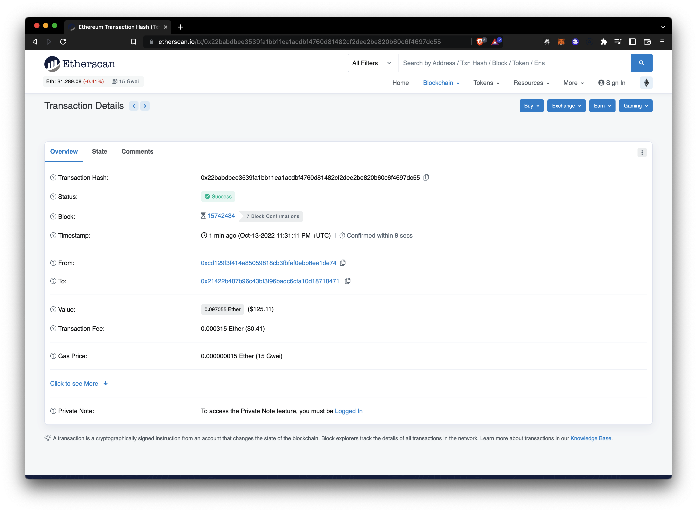

# Ethereum Blockchain Basics

## Hashing

-   Hashing is the result of passing an input through a Cryptographic Hash Function

    ```
    input -> Cryptographic Hash Function (Keccak-256) -> Hash digest
    Example:
    Ethereum -> 564ccaf7594d66b1eaaea24fe01f0585bf52ee70852af4eac0cc4b04711cd0e2
    ```

-   Properties
    -   Deterministic: Same message has the same result
    -   Quick to compute
    -   Cannot be reversed (almost impossible to find the input from the hash)
    -   A small change in the input will radically change the output
    -   Two different messages will never give you the same hash
-   What makes blockchain secure is that hashes are the result of hashing hashes so even a small change changes the whole chain which makes impossible to cheat in the distributed network

## Ethereum Wallet

-   An ethereum wallet is where your accounts are stored
-   It has a 12 word mnemonic seed phrase, this is important because it allows the wallet to create more accounts and also to recover those accouns in case you loose the hardware device where you were storing your accounts, so **it needs to be kept it in a safe place.**
-   And also has a passphrase which encrypts your keys

## Ethereum account

-   An Ethereum account has 2 keys
    -   **Private key** - 64 hex characters (never share it)
    -   **Public key** - The last 20 bytes of the Keccak-256 hash of the public key, adding 0x to the beginning (you can share it)
    -   You can create a public key from your private key but you cannot create a private key from a public key

## Metamask

### Ethereum wallet both for mobile and as a browser plug-in

-   Browser Download: [metamask.io](https://metamask.io/)
    -   This pluggin have support just for some browsers, if you prefer to use one that doesn't support it you can still use your mobile wallet with [WalletConnect](https://walletconnect.com)

### Setup

-   Add a strong pasword (for local encryption)
-   Save your mnemonic seed phrase (12 words)
    -   If someone gets it will have access to your funds
-   Enter your phrase
-   Now you can use your wallet (pin it to your browser bar)

    -   For development you'll have to use test network, if you don't have them active you'll have to check them
    -   Create also a different address for development purposes
    -   Get faucet ether by pressing the buy button after switching to the test network

-   [Reference setup](https://ethereum-blockchain-developer.com/2022-03-deposit-withdrawals/01-installing-configuring-metamask/)
-   [Reference faucet](https://ethereum-blockchain-developer.com/2022-03-deposit-withdrawals/02-getting-testnet-ether/)

### Metamask Behind the Scenes

-   Metamask access to a blockchain node through the [Infura API](https://infura.io/)
-   When you submit a transaction on a Dapp the backend of this DApp connects with the blockchain node and performs the logic of the contract attached to that transaction

## Transactions Behind the Scense

-   When you start an Ethereum transaction a function is triggered behind the scenes, in [web3.js](https://web3js.readthedocs.io/) it is in the following way:

    ```JavaScript
    //https://web3js.readthedocs.io/en/v1.8.0/web3-eth.html?highlight=sendtransaction#sendtransaction
    web3.eth.sendTransaction(transactionObject [, callback])
    ```

    -   This transaction is going to send a `transactionObject` that contains the following data:

        ***

        -   #### Important!

        -   **from:** address for the sending account.
        -   **to:** destination address.
        -   **value:** value transferred for the transaction in wei.
        -   **gas:** amount of gas to use for the transaction (unused gas is refunded).
        -   **gasPrice:** price of gas for this transaction in wei.

        ***

        -   **type:** positive unsigned 8-bit number (0-0x7f) that represents the type of the transaction.
        -   **maxFeePerGas** maximum fee per gas that the transaction is willing to pay in total.
        -   **maxPriorityFeePerGas** maximum fee per gas to give miners to incentivize them to include the transaction (Priority fee)
        -   **accessList** list of addresses and storage keys that the transaction plans to access.

        ***

        -   #### Important!

        -   **data:** ABI byte string containing the data of the function call on a contract (in contract-creation transaction the initialisation code).
        -   **nonce:** Integer that allows to overwrite your own pending transactions that use the same nonce.

        ***

        -   **chain:** Defaults to `mainnet`.
        -   **hardfork:** Defaults to `london`.
        -   **commonObject**
            -   **customChain**
                -   **name**
                -   **networkId**
                -   **chainId**
            -   **baseChain**
            -   **hardfork**

### Block Explorer

-   A block explorer like Metamask connects to the blockchain throug
-   You can check the status of a transaction through a block explorer

    -   The most popular for ETH is [etherscan.io](https://etherscan.io/) which also has other EVM compatible chains (Polygon, Avalanche, etc)
    -   You can paste an address or transaction hash in the searching input to access to that specific data in the blockchain
    -   Example:

    

### Transaction signature

-   Every transaction is signed using the private key of the owner and the transaction to create a cryptographic hash digest
    ```
    Transaction ⎤
                + —> Signed Transaction (R S V values of a transaction)
    Private Key ⎦                                                     ⎥
    ⎢                                                                 ⎥
    ⎢ Elliptic Curve Digital Signature Algorithm (ECDSA)              ⎥
    ⎢                                                                 ⎥
    ⎣ Public Key -> Ethereum Account <--------------------ECRECOVER---⎦
    ```
    -   For a transaction to be valid the `ECRECOVER` should match the from field of the transaction

### Update/Cancel Transaction

-   The higher the price the more likely a transaction gets validated
-   Sending a transaction with the same nonce twice:
    -   **Update:** the one with higher gas fee is the one that will be taken
    -   **Cancel:** send it with no data or `to == from`
        -   You can do this with Metamask by using the custom nonce option matching the nonce from the previous transaction and sending the value to yourself
            -   Be sure to cancel pending transactions with a higher nonce first

[Reference Update/Cancel Transactions](https://ethereum-blockchain-developer.com/2022-03-deposit-withdrawals/06-cancel-update-transactions/)

## What is a smart contract?

-   Piece of code that runs on the blockchain and needs a transaction to change it's state
-   Is turing complete, which in theory allows it to solve any computation problem
-   They're written in a high-level programming language (Vyper, Solidity) which translates the code into EVM Bytecode
-   Every node in the Ethereum network will execute the same code
-   Solidity is the most popular Ethereum language which makes it the best to use

## Contract structure

-   Class like structure
-   Contains functions
-   Has conditionals `if/else`
-   Has loops `for/while`
-   Has data types
    -   Unsigned and signed integers `int/uint`, booleans, arrays
    -   Structs, mappings, addresses
    -   No floating point numbers are allowed
-   Is inheritable
-   It has special structures like modifiers
-   It has imports
-   Example of the structure:

    ```Solidity
    //SPDX-License-Identifier: undefined
    pragma solidity 0.8.14;

    contract MyContract {
        // Contract body
    }
    ```

-   The first line of every contract is the [The Software Package Data Exchange® (SPDX®)](https://spdx.dev/), if you don't have a license add `undefined` if you have one add its name like `MIT`
    ```Solidity
    //SPDX-License-Identifier: Undefined
    ```
-   Then add the solidity version you'll use for the contract
    ```Solidity
    pragma solidity 0.8.14;
    pragma solidity ^0.8.0
    pragma solidity >=0.8.0 and <0.9.0;
    ```
-   And finally add your contract's name (Cap word and camelCase) logic

    ```Solidity
    contract MyContract {
        // Contract body
        // Variable with a string
        string public ourMessage = "My message";

        // Function that modifies the string
        // and accepts a string storaged in the memory as an argument
        function updateOurMessage(string memory updateMessage) public {
            ourMessage = updateMessage;
        }
        // Every transaction that triggers the function
        // will change the variable on the blockchain
    }
    ```

-   When the contract is deployed on the blockchain it gets its own address after a transaction is submited to a 0x0 address

### References

-   [Starting, Stopping and Interacting with Smart Contracts](https://ethereum-blockchain-developer.com/2022-01-remix-introduction/02-starting-stopping-interacting/)
-   [Read and write a contract](https://ethereum-blockchain-developer.com/2022-01-remix-introduction/04-read-write-to-smart-contract/)
