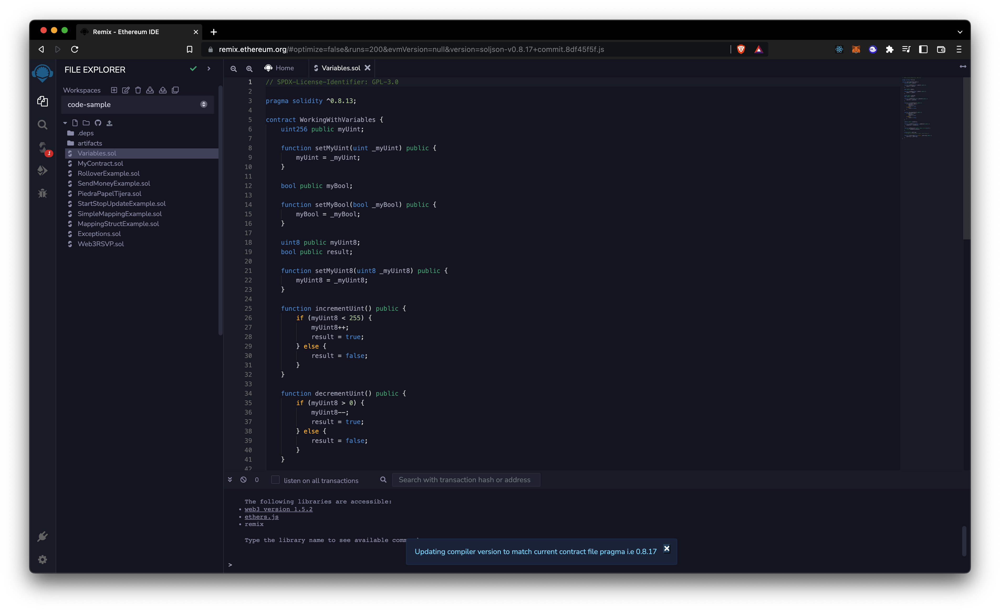
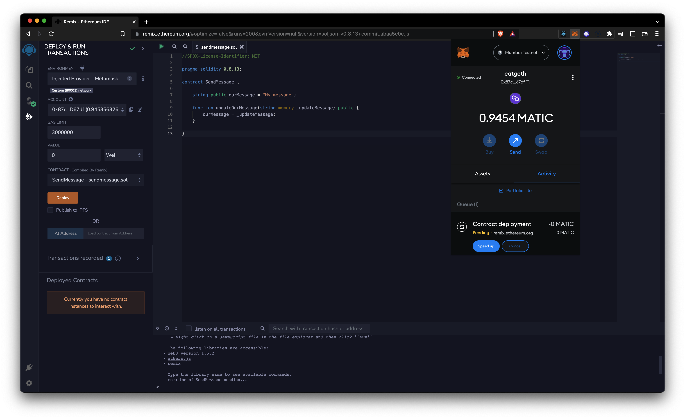

# Remix

## Intro

### [remix.ethereum.org](https://remix.ethereum.org) [^1]

> -   Online IDE for solidity development
> -   The easiest way to get into Ethereum development
> -   Developed with JavaScript so you can add JS packages (ethers.js, web3.js)

#### Remix UI

-   Workspaces
    -   Like folders where you add your contracts
-   Solidity extension is `.sol`
-   You can add plugins to your environment
-   Compiling problems will appear in the compile section, correct them before deploying
    -   It's a good idea to turn the autocompiler on
-   When you want to test your contract you can use the deploy button
    -   You can deploy it with an [injected test environment](https://remix-ide.readthedocs.io/en/latest/run.html#environment), the easiest way to start is with `Remix VM (London)`
    -   Every change in your contract will need redeployment
-   I the terminal your transactions will be visible with details like gas, cost, etc

[Reference Remix Intro](https://ethereum-blockchain-developer.com/2022-01-remix-introduction/01-setup-remix/)

## Injected Web3 Provider

-   When you select the Injected Provider - Metamask as a provider in Remix you'll have access to the Infura node connected to Metamask
-   In this environment you'll be able to deploy your contract to a test network or even mainnet
    
-   Now you'll be able to make transactions in the testnet
-   Check the contract and transactions on the block explorer [0xfc42ad9f7c3cdca8fd64a12d2b5d7abae3bb01dc](https://mumbai.polygonscan.com/address/0xfc42ad9f7c3cdca8fd64a12d2b5d7abae3bb01dc)

[Reference Injected Web3 Provider](https://ethereum-blockchain-developer.com/2022-03-deposit-withdrawals/07-injected-web3-provider/)

[^1]: Be careful with the security protocol, if it starts `http` and then changes to `https` your content will be lost.
